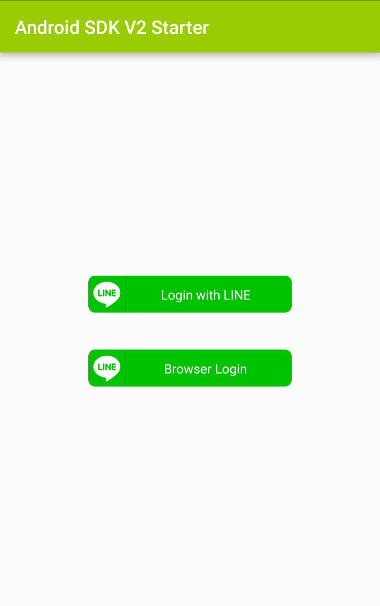

# line-android-v2-starter
LINE Android SDK V2 starter

# Introduction

This is a sample application for LINE Android SDK V2. It demonstrates the following functionality:

* App-to-app Login
* Web Login
* GetProfile API
* Verify Token API
* Refresh Token API
* Logout API

# Before Starting

* You must have [Android Studio](https://developer.android.com/studio/index.html) installed.
* You must create a LINE Login account on the [LINE Business Center](https://business.line.me) that has the application type set to `NATIVE_APP`. You will need the account's Channel ID to set up the SDK.

# Setup

1. Download the SDK aar file (`line-sdk-x.x.x`) from the LINE Developer Console and put it into the `app/libs` folder.
2. Set the CHANNEL_ID constant in Constants.java to your Channel ID and then open the project in Android Studio and build it as you would with any normal Android application.

# How to Use

<kbd></kbd>

The **Login with LINE** button will use the LINE App to log in and the **Browser Login** button will open a Web Login screen inside of a Chrome custom tab.

After logging in, the user's profile information and access token will be displayed on the screen in addition four buttons:

* **GET PROFILE** - Pushing this button will call the LINE SDK's `getProfile()` method. The profile information retrieved from the API will appear in a Popup Dialog.
This information should be the same as the profile information that is initially displayed to the user after they log into this starter application.
* **VERIFY TOKEN** - Pushing this button will call the LINE SDK's `verifyToken()` method. A will appear informing the user if their token is valid or not.
* **REFRESH TOKEN** - Pushing this button will call the LINE SDK's `refreshAccessToken()` method. This will update the access token that is displayed on the starter app's main screen.
* **LOGOUT** - Pushing this button will call the LINE SDK's `logout()` method. This will revoke the access token and return the user to the "Select Login" page.

# Documentation

For detailed documentation, please refer to these links:

* [LINE Developer Center's Android SDK Documentation](https://developers.line.me/android/overview)
* [LINE SDK for Android API Reference](https://devdocs.line.me/en/#line-sdk-for-android-api-reference)
